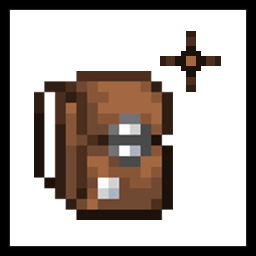

  

---

<strong>English</strong> | <a href="README_zh.md"><strong>简体中文</strong></a>

---

## 🎒 Quark Backpack Plus

A lightweight Minecraft 1.21.1 NeoForge mod that adds two practical features to Quark's backpack:

- **Equip to Curios "Back" slot** – No longer occupies the chestplate slot.
- **Open shulker boxes directly from backpack** – More convenient without moving items to inventory.

---

## 📌 Dependencies

|                              Mod                              | Required |   Description    |
|:-------------------------------------------------------------:|:--------:|:----------------:|
|            [Quark](https://modrinth.com/mod/quark)            |   Yes    | Core dependency  |
|   [Quark Oddities](https://modrinth.com/mod/quark-oddities)   |   Yes    | Unlocks backpack |
|         [Curios API](https://modrinth.com/mod/curios)         |   Yes    |   Slot support   |

---

## 📥 Download

- [CurseForge](https://www.curseforge.com/minecraft/mc-mods/quark-backpack-plus)
- [Modrinth](https://modrinth.com/mod/quark-backpack-plus)
